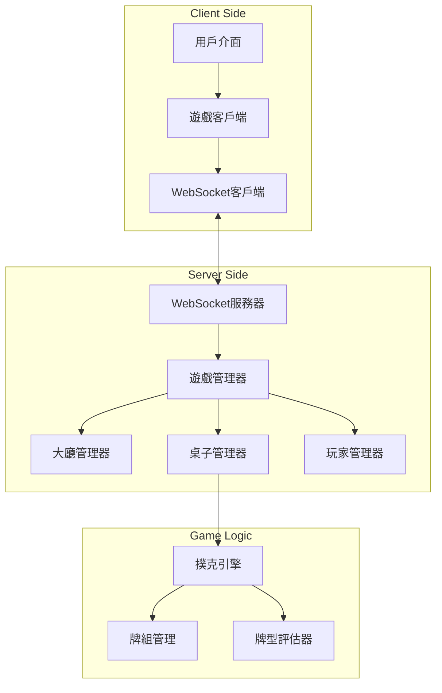
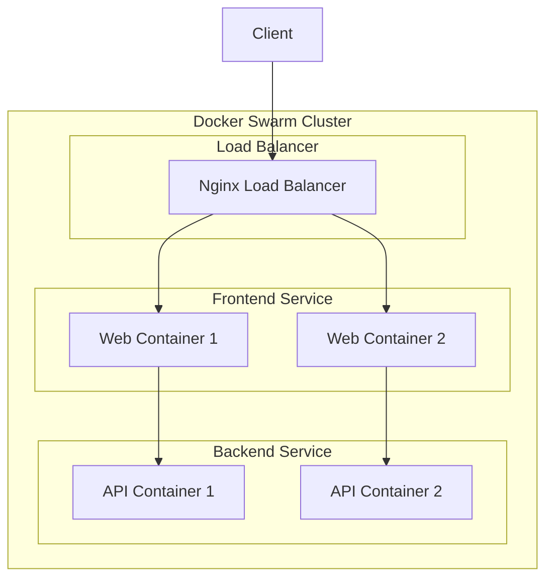

# Design Document

## Overview

線上多人德州撲克遊戲是一個即時多人遊戲系統，採用客戶端-服務器架構。系統使用WebSocket進行即時通訊，確保所有玩家能夠同步接收遊戲狀態更新、聊天訊息和其他玩家的動作。

核心設計原則：
- **即時同步**: 使用WebSocket確保所有玩家狀態同步
- **狀態管理**: 服務器端維護權威遊戲狀態
- **模組化設計**: 分離遊戲邏輯、網路通訊和UI層
- **容錯處理**: 處理玩家斷線、網路延遲等問題

## Architecture

### 系統架構圖



### 技術棧選擇

**前端 (客戶端)**:
- HTML5/CSS3/JavaScript (或 TypeScript)
- WebSocket API 用於即時通訊
- Canvas 或 SVG 用於撲克牌和桌子渲染

**後端 (服務器)**:
- Node.js + Express.js 作為Web服務器
- Socket.IO 用於WebSocket通訊管理
- 內存存儲 (Map/Object) 用於遊戲狀態暫存

**部署環境**:
- Docker 容器化部署
- Docker Swarm 集群管理
- 一鍵部署腳本

## Components and Interfaces

### 1. 客戶端組件

#### GameClient
```typescript
interface GameClient {
  connect(playerName: string): Promise<void>
  joinTable(tableId: string): Promise<void>
  leaveTable(): Promise<void>
  sendChatMessage(message: string): void
  makeAction(action: PlayerAction): void
  disconnect(): void
}
```

#### UI Components
- **LoginScreen**: 玩家名稱輸入介面
- **LobbyScreen**: 大廳桌子列表顯示
- **GameTable**: 撲克桌遊戲介面
- **ChatPanel**: 聊天功能面板

### 2. 服務器端組件

#### GameManager
```typescript
interface GameManager {
  addPlayer(player: Player): void
  removePlayer(playerId: string): void
  handlePlayerAction(playerId: string, action: PlayerAction): void
  broadcastToTable(tableId: string, event: GameEvent): void
}
```

#### LobbyManager
```typescript
interface LobbyManager {
  getAvailableTables(): Table[]
  findAvailableTable(): Table | null
  createNewTable(): Table
  removeEmptyTable(tableId: string): void
}
```

#### TableManager
```typescript
interface TableManager {
  addPlayerToTable(player: Player, tableId: string): boolean
  removePlayerFromTable(playerId: string, tableId: string): void
  startGame(tableId: string): void
  processPlayerAction(tableId: string, playerId: string, action: PlayerAction): void
}
```

### 3. 遊戲邏輯組件

#### PokerEngine
```typescript
interface PokerEngine {
  startNewRound(players: Player[]): GameRound
  dealCards(round: GameRound): void
  processAction(round: GameRound, playerId: string, action: PlayerAction): GameState
  evaluateWinner(round: GameRound): WinnerResult
  distributePot(round: GameRound, winner: WinnerResult): void
}
```

## Data Models

### Core Data Structures

#### Player
```typescript
interface Player {
  id: string
  name: string
  chips: number
  tableId: string | null
  seatPosition: number | null
  isOnline: boolean
  lastActivity: Date
}
```

#### Table
```typescript
interface Table {
  id: string
  players: Map<string, Player>
  maxPlayers: number
  currentGame: GameRound | null
  isActive: boolean
  createdAt: Date
}
```

#### GameRound
```typescript
interface GameRound {
  id: string
  tableId: string
  players: Player[]
  dealerPosition: number
  smallBlindPosition: number
  bigBlindPosition: number
  currentPlayerPosition: number
  pot: number
  communityCards: Card[]
  phase: GamePhase // 'preflop' | 'flop' | 'turn' | 'river' | 'showdown'
  bettingRound: number
  lastAction: PlayerAction | null
}
```

#### PlayerAction
```typescript
interface PlayerAction {
  type: 'fold' | 'check' | 'call' | 'raise' | 'all-in'
  amount?: number
  playerId: string
  timestamp: Date
}
```

#### Card
```typescript
interface Card {
  suit: 'hearts' | 'diamonds' | 'clubs' | 'spades'
  rank: 'A' | '2' | '3' | '4' | '5' | '6' | '7' | '8' | '9' | '10' | 'J' | 'Q' | 'K'
}
```

### 遊戲狀態管理

#### GameState
```typescript
interface GameState {
  tableId: string
  players: PlayerGameState[]
  communityCards: Card[]
  pot: number
  currentPlayer: string | null
  phase: GamePhase
  minBet: number
  lastAction: PlayerAction | null
}
```

#### PlayerGameState
```typescript
interface PlayerGameState {
  playerId: string
  name: string
  chips: number
  bet: number
  cards: Card[] // 只有該玩家能看到自己的牌
  position: number
  isActive: boolean
  hasActed: boolean
}
```

## Error Handling

### 網路錯誤處理

1. **連線中斷處理**
   - 客戶端自動重連機制
   - 服務器端玩家離線狀態管理
   - 30秒超時自動棄牌機制

2. **數據同步錯誤**
   - 客戶端狀態驗證機制
   - 服務器端權威狀態恢復
   - 錯誤狀態回滾機制

### 遊戲邏輯錯誤處理

1. **無效動作處理**
   - 動作驗證機制
   - 自動糾正無效動作
   - 錯誤訊息回饋

2. **籌碼不足處理**
   - 自動移回大廳
   - 重新分配預設籌碼
   - 通知其他玩家

### 系統錯誤處理

1. **服務器錯誤**
   - 錯誤日誌記錄
   - 優雅降級機制
   - 自動恢復機制

2. **資源管理**
   - 內存洩漏防護
   - 定期清理無效連線
   - 桌子資源自動回收

## Testing Strategy

### 單元測試

1. **遊戲邏輯測試**
   - 撲克牌型評估測試
   - 下注邏輯測試
   - 獎池分配測試

2. **狀態管理測試**
   - 玩家狀態轉換測試
   - 桌子狀態管理測試
   - 遊戲回合流程測試

### 整合測試

1. **網路通訊測試**
   - WebSocket連線測試
   - 訊息廣播測試
   - 斷線重連測試

2. **多玩家同步測試**
   - 多客戶端同步測試
   - 並發動作處理測試
   - 狀態一致性測試

### 端到端測試

1. **完整遊戲流程測試**
   - 從登入到遊戲結束的完整流程
   - 多桌子並行遊戲測試
   - 玩家進出桌子測試

2. **壓力測試**
   - 多玩家並發連線測試
   - 高頻率動作處理測試
   - 長時間運行穩定性測試

### 測試工具和框架

- **單元測試**: Jest 或 Mocha
- **整合測試**: Supertest + Socket.IO Client
- **端到端測試**: Playwright 或 Cypress
- **負載測試**: Artillery 或 k6

## Performance Considerations

### 客戶端優化

1. **渲染優化**
   - 使用requestAnimationFrame進行動畫
   - 避免頻繁的DOM操作
   - 實現虛擬滾動（如果需要）

2. **網路優化**
   - 訊息批次處理
   - 壓縮WebSocket訊息
   - 實現訊息優先級

### 服務器端優化

1. **內存管理**
   - 定期清理無效玩家數據
   - 實現對象池重用
   - 避免內存洩漏

2. **並發處理**
   - 使用事件驅動架構
   - 避免阻塞操作
   - 實現適當的錯誤隔離

## Deployment Architecture

### Docker 容器化設計

#### 容器結構


#### Docker 服務配置

**Frontend Container (Nginx + Static Files)**:
- 提供靜態HTML/CSS/JS文件
- 反向代理到後端API
- WebSocket升級支援

**Backend Container (Node.js Application)**:
- 遊戲邏輯處理
- WebSocket服務
- API端點

#### Docker Compose 配置結構
```yaml
version: '3.8'
services:
  frontend:
    build: ./frontend
    ports:
      - "80:80"
    deploy:
      replicas: 2
      
  backend:
    build: ./backend
    ports:
      - "3000:3000"
    deploy:
      replicas: 2
      
  nginx:
    image: nginx:alpine
    ports:
      - "8080:80"
    deploy:
      replicas: 1
```

### Docker Swarm 部署策略

#### 服務擴展性
- **水平擴展**: 支援多個後端實例
- **負載均衡**: Nginx作為負載均衡器
- **會話親和性**: Socket.IO sticky sessions配置

#### 高可用性配置
- **服務副本**: 每個服務至少2個副本
- **健康檢查**: 容器健康狀態監控
- **自動重啟**: 失敗容器自動重啟

#### 部署腳本設計
```bash
#!/bin/bash
# deploy.sh - 一鍵部署腳本

# 1. 構建Docker映像
# 2. 初始化Docker Swarm (如果需要)
# 3. 部署服務堆疊
# 4. 驗證部署狀態
```

### 狀態管理考量

#### 多實例狀態同步
由於使用內存存儲，需要考慮多個後端實例間的狀態同步：

**解決方案選項**:
1. **Sticky Sessions**: 將玩家綁定到特定實例
2. **Redis Adapter**: 使用Redis進行Socket.IO適配器
3. **Database Sync**: 定期同步到共享存儲

**推薦方案**: 使用Socket.IO Redis Adapter進行實例間通訊

## Security Considerations

### 客戶端安全

1. **輸入驗證**
   - 玩家名稱格式驗證
   - 聊天訊息內容過濾
   - 防止XSS攻擊

2. **狀態保護**
   - 隱藏其他玩家的底牌
   - 防止客戶端狀態篡改
   - 實現適當的權限控制

### 服務器端安全

1. **動作驗證**
   - 驗證玩家動作的合法性
   - 防止作弊行為
   - 實現速率限制

2. **數據保護**
   - 敏感數據加密
   - 安全的隨機數生成（洗牌）
   - 防止數據洩露

### 容器安全

1. **映像安全**
   - 使用官方基礎映像
   - 定期更新依賴項
   - 掃描安全漏洞

2. **運行時安全**
   - 非root用戶運行
   - 最小權限原則
   - 網路隔離配置